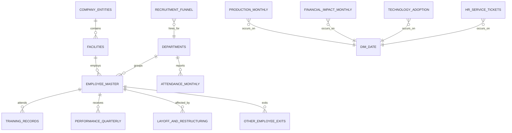

# Database Relationship Map

## Reporting layer

`vw_bi_` views reduce modelling effort for portfolio dashboards:

- `vw_bi_quarterly_business_summary`
- `vw_bi_production_finance_monthly`
- `vw_bi_workforce_bridge`
- `vw_bi_kpi_scorecard_long`
- `vw_bi_pillar_maturity_long`
- `vw_bi_recruitment_quarterly`
- `vw_bi_training_quarterly`
- `vw_bi_department_people_summary`
- `vw_bi_pilot_vs_control`

For a proper star schema, use `dim_date`, employee/department/entity dimensions and the original fact tables instead of only the flattened views.
