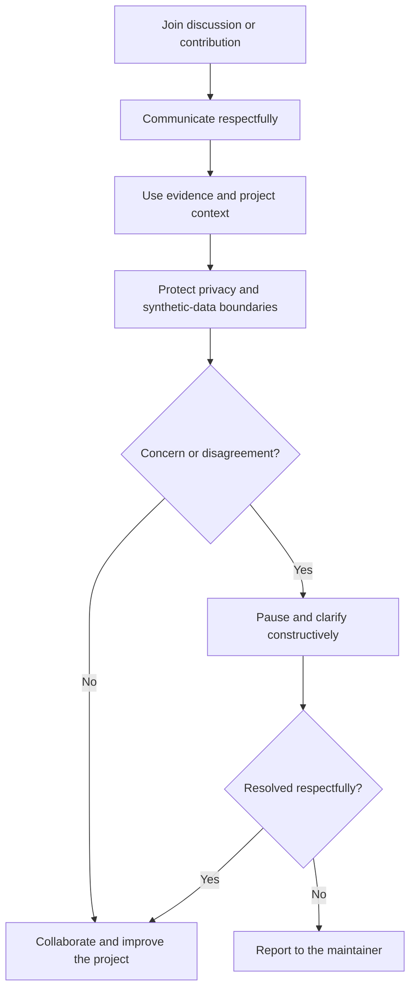
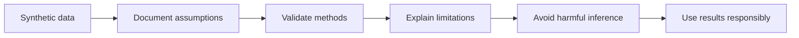
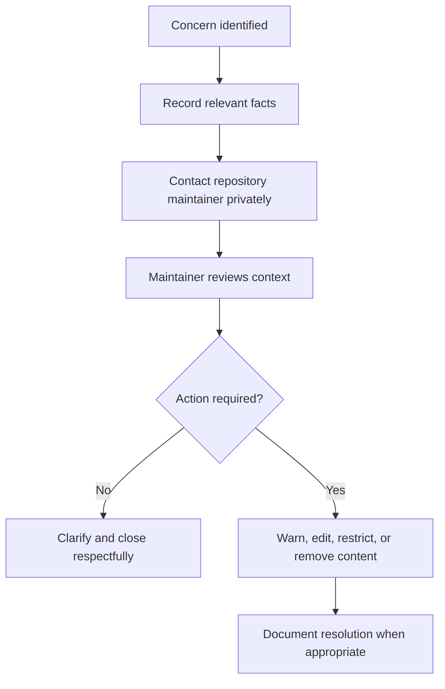

# Code of Conduct

## Our commitment

We are committed to making participation in the **Sabia Group HRBP Smartwatch Recovery 2026** project respectful, inclusive, professional, and safe for everyone.

This repository is an educational and portfolio-focused analytics project. Collaboration should reflect the same care expected in responsible HR, people analytics, data governance, and professional software communities.

## Community behavior flow

## Expected behavior

Participants should:

- communicate with professionalism, patience, and respect;
- welcome constructive feedback and different analytical perspectives;
- explain technical, HR, data, or documentation decisions clearly;
- focus criticism on the work, not the person;
- respect privacy, confidentiality, and ethical data boundaries;
- acknowledge mistakes and correct them transparently;
- support beginners with clear and practical guidance;
- preserve the synthetic and educational nature of the project.

## Unacceptable behavior

The following are not acceptable:

- harassment, insults, intimidation, or discriminatory language;
- personal attacks or deliberately hostile communication;
- sharing private, personal, employee, or confidential company information;
- publishing credentials, API keys, or restricted data;
- using protected characteristics as unfair employment-decision criteria;
- presenting synthetic outcomes as verified real-world results;
- spam, malicious code, deceptive changes, or disruptive conduct;
- retaliation against anyone who raises a concern in good faith.

## Responsible analytics principles

Contributors must not use this project to justify real employment, disciplinary, restructuring, compensation, or termination decisions without appropriate legal, ethical, privacy, and human review.

## Reporting and response process

When reporting a concern, include only the information necessary to understand the issue. Do not publicly repost sensitive or harmful material.

## Enforcement

Repository maintainers may edit or remove comments, commits, issues, pull requests, or other contributions that violate this Code of Conduct. Repeated or serious violations may result in temporary or permanent restrictions from project participation.

Enforcement decisions will consider context, impact, intent, recurrence, safety, and the need to protect the community and project integrity.

## Scope

This Code of Conduct applies to repository discussions, issues, pull requests, reviews, documentation, linked project spaces, and public representation of the project.

## Project principle

> Respect people. Protect data. Explain decisions. Improve the work.
