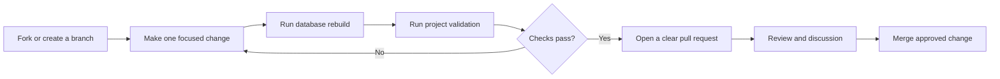
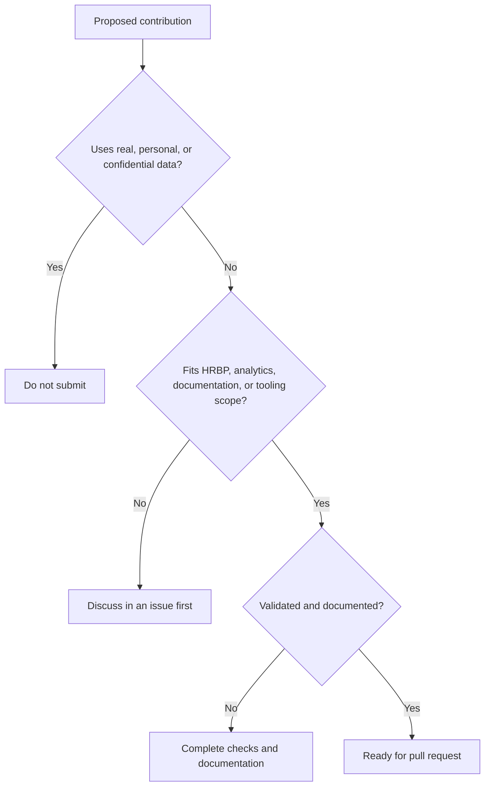

# Contributing

Thank you for helping improve the **Sabia Group HRBP Smartwatch Recovery 2026** portfolio project.

Contributions are welcome for:

- SQL portability improvements
- Power BI measures and report-page examples
- Python validation and testing
- Data documentation and schema improvements
- Additional responsible-HR analytics exercises

## Contribution workflow



## Step-by-step process

1. Create a branch with a clear name, such as `docs/update-data-dictionary` or `feature/add-sql-view`.
2. Make a focused change that is easy to review.
3. Rebuild the database:

   ```bash
   python 13_Database_SQL/00_build_database.py
   ```

4. Run repository validation:

   ```bash
   python scripts/validate_project.py
   ```

5. Review changed files and confirm that generated outputs are intentional.
6. Open a pull request describing:
   - what changed;
   - why the change is useful;
   - which files or analytics layers are affected;
   - how the change was validated.

## Contribution decision guide



## Data and ethics requirements

Do not add:

- real employee records;
- personally identifiable information;
- private contact details;
- credentials or API keys;
- confidential company information;
- discriminatory decision rules;
- unsupported claims presented as real business outcomes.

All contributed example data must remain clearly synthetic and suitable for education, practice, and portfolio demonstration.

## Documentation standards

- Use clear file and folder names.
- Update the data dictionary when schemas change.
- Describe new SQL views, Python scripts, notebooks, measures, or workbooks.
- Keep GitHub and Kaggle paths consistent where practical.
- Avoid duplicate files unless the duplication has a documented publishing purpose.

## Pull request checklist

- [ ] The change is focused and within project scope.
- [ ] No real or confidential data is included.
- [ ] Database rebuild completed successfully, when applicable.
- [ ] Repository validation completed successfully.
- [ ] Documentation and data dictionary entries were updated.
- [ ] The pull request explains analytical and user impact.
