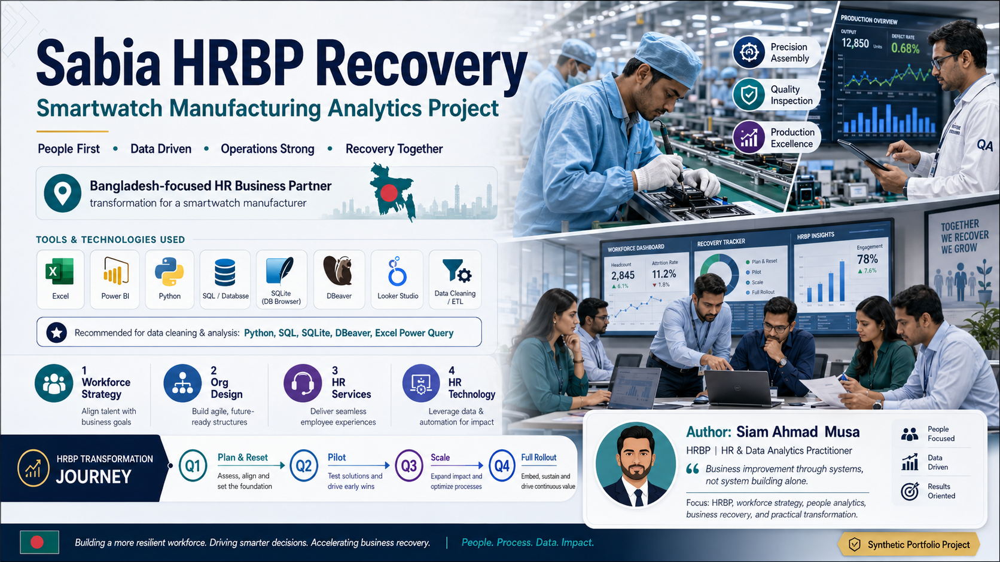

# Sabia Group HRBP Smartwatch Recovery 2026



<p align="center">
  <a href="https://github.com/samusa099/sabia-hrbp/actions/workflows/validate-project.yml"></a>
  
  
  
  
</p>

<p align="center">
  
  
  
  
  
  
</p>

## Portfolio overview

**Sabia Group HRBP Smartwatch Recovery 2026** is a synthetic HR Business Partner and data analytics portfolio project created by **Musa ( Musa)**.

The project simulates a Bangladesh-based smartwatch manufacturing company facing workforce, quality, productivity and financial challenges. It demonstrates how HRBP decisions can be connected with production and financial outcomes through Excel, Power BI, Python, SQL and SQLite.

> **Project philosophy:** Business improvement through systems, not system building alone.

## Project status

- Repository structure: complete
- Synthetic practice data: complete
- Excel analytics package: complete
- Python cleaning and validation workflow: complete
- SQL and SQLite database layer: complete
- Power BI documentation and DAX guidance: complete
- Kaggle dataset and notebook assets: complete
- GitHub Actions validation: live
- Missing or invalid employee join dates: filtered during cleaning and reported through validation controls

## Executive case

Sabia Group invested heavily in a **Made-in-Bangladesh smartwatch operation** but moved into production before validating an MVP or prototype. The simulated business then experienced:

- high defect and rework rates;
- low first-pass yield;
- excessive overtime;
- employee skill gaps;
- duplicated or mismatched roles;
- fragmented HR and production data;
- sustained operating losses;
- increased risk of a distressed business sale.

A newly appointed **Lead HR Business Partner**, also acting as **Head of HR / Acting CHRO**, was asked to diagnose the business with data and design a responsible recovery path.

## Q1–Q4 transformation story

- **Starting workforce:** 100 employees
- **Q1 — Plan and reset:** feasibility analysis, workforce diagnosis, KPI design and a documented 48-role reset scenario
- **Q2 — Controlled pilot:** 25 employees on Line A with HR, QA, Engineering and IT support
- **Q3 — Scale and stabilize:** Lines A and B, critical-skill hiring and manager dashboards
- **Q4 — Full rollout:** group-wide HR operating model, benefits review and governance handover
- **End-of-year active workforce:** 114 employees
- **Final product quality:** 97.1% first-pass yield and 2.4% defect rate
- **Business outcome:** movement from critical sale risk toward a profitable operating model

## What this project demonstrates

### HRBP and workforce strategy

- people strategy;
- workforce planning and restructuring scenarios;
- organization design;
- critical-skill protection;
- talent acquisition and recruitment;
- training and certification;
- performance management;
- rewards and recognition;
- employee relations;
- HR services and HR technology;
- legal, regulatory and ethical considerations;
- employee exits and knowledge-transfer planning.

### Data and analytics practice

- Excel formulas, tables, charts and KPI scorecards;
- Power Query data preparation;
- Power BI star-schema modelling, DAX and executive storytelling;
- Python data cleaning, validation and exploratory analysis;
- SQL cleaning views, audit queries and reporting views;
- SQLite database practice using DB Browser, DBeaver or SQLiteStudio;
- production, quality, workforce and financial linkage;
- Kaggle dataset and notebook publishing.

## Data-cleaning workflow

The deliberately messy employee data contains realistic quality issues such as inconsistent text values, mixed date formats, missing fields and duplicate employee IDs.

The Python workflow:

1. standardizes names, gender values and department labels;
2. parses join and exit dates using `errors="coerce"`;
3. converts invalid join dates to missing values;
4. removes duplicate employee IDs;
5. filters records that do not contain a valid required `Join_Date`;
6. validates primary keys and required fields;
7. writes clean outputs and a data-quality report.

Run the workflow with:

```bash
python -m pip install -r 07_Python/requirements.txt
python 07_Python/clean_and_validate.py
```

Generated outputs are written to:

```text
07_Python/generated_clean_output/
```

## Database and SQL extension

The repository includes a ready-to-open SQLite database:

```text
13_Database_SQL/Sabia_Group_HRBP_Analytics.sqlite
```

It contains:

- raw staging tables;
- clean analytical tables;
- SQL-based cleaning views;
- data-quality audit objects;
- HRBP analytics queries;
- `vw_bi_` reporting views for BI tools.

Rebuild the database with:

```bash
python 13_Database_SQL/00_build_database.py
```

Recommended tools:

- DB Browser for SQLite
- DBeaver
- SQLiteStudio
- Python `sqlite3`
- Power BI or Excel through ODBC

## Folder map

| Folder | Purpose |
|---|---|
| `00_Master` | Master Excel analytics workbook |
| `01_Q1...` to `04_Q4...` | Quarter-specific evidence and analysis |
| `05_Raw_Data` | Deliberately messy practice data |
| `06_Clean_Data` | Analysis-ready datasets |
| `07_Python` | Cleaning, validation and EDA scripts |
| `08_PowerBI` | Model, DAX and dashboard guidance |
| `09_Looker_Studio` | Optional connector and calculated-field guidance |
| `10_Kaggle` | Dataset metadata, notebook and publishing assets |
| `11_Documentation` | Business case, methodology and ethics |
| `12_Reference` | Design and project references |
| `13_Database_SQL` | SQLite database, SQL scripts, audits and BI views |
| `wiki` | GitHub Wiki-compatible project documentation |

## Project Wiki

- [Home](wiki/Home.md)
- [Project Overview](wiki/Project-Overview.md)
- [Q1–Q4 Transformation Story](wiki/Transformation-Journey.md)
- [Data Architecture and Dictionary](wiki/Data-Architecture.md)
- [SQL and Database Lab](wiki/SQL-and-Database.md)
- [Power BI and BI Tools](wiki/Power-BI-and-BI-Tools.md)
- [Python Data Cleaning](wiki/Python-Data-Cleaning.md)
- [Kaggle Publishing](wiki/Kaggle-Publishing.md)
- [Ethics and Limitations](wiki/Ethics-and-Limitations.md)

## Suggested analysis questions

1. How did workforce actions affect first-pass yield and defect rates?
2. Did training and certification support production recovery?
3. Which departments experienced the highest overtime and absence pressure?
4. Did the pilot group outperform the control group?
5. How did defect reduction relate to operating profit?
6. Which HR interventions created the strongest simulated business impact?
7. What data-quality issues must be resolved before management reporting?

## Ethics and limitations

All people, entities, events, production results and financial values in this repository are **fictional and synthetically generated for practice, education and portfolio demonstration**.

This project:

- does not contain real employee or confidential company data;
- is not an audit of a real organization;
- does not establish causal relationships;
- must not be used to make real employment decisions;
- does not replace legal, labour-law, privacy or ethical review.

Protected characteristics such as gender, age, religion, disability, pregnancy, ethnicity or health status should never be used as unfair employment-decision criteria.

## Author

**Musa —  Musa**  
HRBP | HR & Data Analytics Practitioner  
Bangladesh

Focus areas:

- HR Business Partnering;
- workforce strategy;
- people analytics;
- business recovery;
- Excel, Power BI, Python and SQL;
- practical data-driven transformation.

## Additional documentation

- [`13_Database_SQL/README_DATABASE_SQL.md`](13_Database_SQL/README_DATABASE_SQL.md)
- [`08_PowerBI/POWER_BI_AND_OTHER_BI_USAGE_GUIDE.md`](08_PowerBI/POWER_BI_AND_OTHER_BI_USAGE_GUIDE.md)
- [`11_Documentation/`](11_Documentation/)

---

**Practice data. Real analytical thinking. Business-focused HRBP portfolio.**
