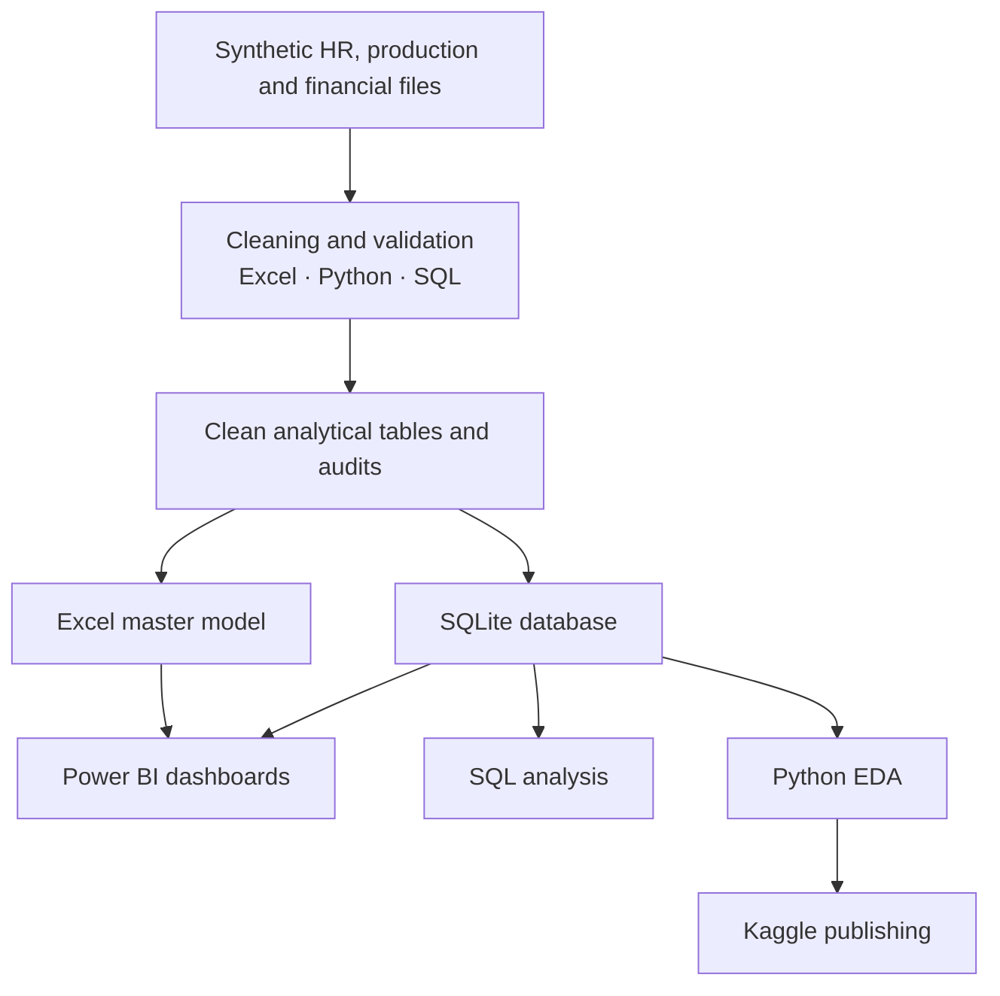
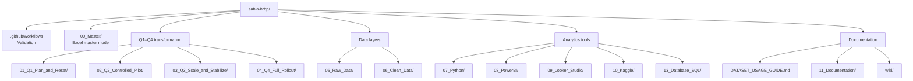

<p align="center">
  
</p>

<h1 align="center">Sabia Group HRBP Smartwatch Recovery 2026</h1>

<p align="center">
  <strong>A synthetic Bangladesh-focused HRBP and business-recovery analytics portfolio.</strong><br>
  Workforce strategy, manufacturing recovery and executive insight across Excel, Power BI, Python, SQL, SQLite and Kaggle.
</p>

<p align="center">
  <a href="https://www.kaggle.com/datasets/samusahr/sabia-hrbp-analytics"></a>
  
  
  
  
  
</p>

<p align="center">
  <a href="https://github.com/samusa099/sabia-hrbp/actions/workflows/validate-project.yml"></a>
  
  
  
  
  
  
</p>

<p align="center">
  <a href="#-overview">Overview</a> ·
  <a href="#-how-to-use-the-dataset">Dataset Use</a> ·
  <a href="#-analytics-architecture">Architecture</a> ·
  <a href="#-repository-structure">Repository</a> ·
  <a href="#-quick-start">Quick Start</a> ·
  <a href="#-data-ethics">Ethics</a>
</p>

---

## ✨ Overview

**Sabia Group HRBP Smartwatch Recovery 2026** is a synthetic HR Business Partner and analytics project created by **Musa**. It simulates a smartwatch manufacturer connecting workforce decisions with production quality, productivity and financial recovery.

> **Business improvement through systems, not system building alone.**

<table>
<tr>
<td width="25%" align="center"><h3>100</h3><sub>Starting workforce</sub></td>
<td width="25%" align="center"><h3>114</h3><sub>Year-end workforce</sub></td>
<td width="25%" align="center"><h3>97.1%</h3><sub>Final first-pass yield</sub></td>
<td width="25%" align="center"><h3>2.4%</h3><sub>Final defect rate</sub></td>
</tr>
</table>

| Area | Coverage |
|---|---|
| Context | Bangladesh-focused synthetic practice data |
| HR scope | Workforce, recruitment, training, performance, ER and HR technology |
| Business scope | Production, quality, productivity, costs and profit |
| Timeline | Q1–Q4 2026 transformation journey |
| Core tools | Excel, Power BI, Python, SQL and SQLite |
| Publishing | GitHub and Kaggle |

---

## 📘 How to use the dataset

Use this project to practise:

- 👥 workforce planning, headcount and critical-skill analysis;
- 🎯 recruitment funnel, time-to-fill and cost-per-hire calculations;
- 🎓 training completion, certification and skill-improvement analysis;
- 🏭 production, FPY, defect, rework and productivity reporting;
- 💰 revenue, operating cost, profit and workforce-cost calculations;
- 🧹 raw-data cleaning, validation and ETL;
- 📊 Excel, Power BI, Python, SQL and SQLite portfolio projects.

### Detailed guide

The complete calculation formulas, workflows, use cases and platform instructions are available here:

<p align="center">
  <a href="DATASET_USAGE_GUIDE.md"><strong>📘 Open the Complete Dataset Usage Guide</strong></a>
</p>

---

## 🧱 Analytics architecture



---

## 🗂️ Repository structure



<details>
<summary><strong>View directory guide</strong></summary>

| Path | Purpose |
|---|---|
| `00_Master/` | Excel master analytics workbook |
| `01_Q1_Plan_and_Reset/` | Feasibility and workforce reset |
| `02_Q2_Controlled_Pilot/` | Pilot design and evaluation |
| `03_Q3_Scale_and_Stabilize/` | Scale-up and stabilization |
| `04_Q4_Full_Rollout/` | Enterprise rollout |
| `05_Raw_Data/` | Messy files for cleaning practice |
| `06_Clean_Data/` | Analysis-ready datasets |
| `07_Python/` | Cleaning, validation and EDA |
| `08_PowerBI/` | Model, DAX and dashboard guidance |
| `09_Looker_Studio/` | BI connector guidance |
| `10_Kaggle/` | Dataset and notebook publishing assets |
| `11_Documentation/` | Business case, methodology and ethics |
| `13_Database_SQL/` | SQLite database, views and SQL library |
| `wiki/` | GitHub Wiki-compatible documentation |

</details>

---

## 🧾 Core analytical tables

| Table | Primary purpose |
|---|---|
| Employee Master | Workforce profile, status, cost and skills |
| Attendance Monthly | Absence, overtime, lateness and safety |
| Recruitment Funnel | Hiring conversion, cost and time-to-fill |
| Training Records | Learning, assessment, certification and cost |
| Production Monthly | Output, FPY, defects and productivity |
| Financial Impact Monthly | Revenue, cost, profit and recovery |
| Pilot Results | Baseline, target, pilot and control comparison |
| Quarterly Scorecard | Executive Q1–Q4 KPI tracking |
| HR Pillar Scores | HR operating-model improvement |
| Data Dictionary | Definitions, grain and metadata |

---

## 🚀 Quick start

```bash
git clone https://github.com/samusa099/sabia-hrbp.git
cd sabia-hrbp
python -m pip install -r 07_Python/requirements.txt
python 07_Python/clean_and_validate.py
python 07_Python/eda_hrbp_recovery.py
```

### SQLite

```bash
python 13_Database_SQL/00_build_database.py
```

```sql
SELECT *
FROM vw_bi_quarterly_business_summary
ORDER BY Quarter;
```

---

## 🧭 Q1–Q4 journey

| Quarter | Focus |
|---|---|
| **Q1** | Feasibility, workforce diagnosis and reset planning |
| **Q2** | 25-person controlled pilot on Line A |
| **Q3** | Critical-skill hiring, scaling and stabilization |
| **Q4** | Group-wide rollout, benefits review and governance |

---

## 🛡️ Data ethics

All people, entities, events, production results and financial values are **fictional and synthetically generated**.

- No real employee or confidential company data is included.
- The project must not be used to make real employment decisions.
- Results do not establish causal relationships.
- Real use requires legal, labour-law, privacy and ethical review.

---

## 👤 Musa

<p align="center">
  <strong>HRBP | HR & Data Analytics Practitioner | Bangladesh</strong><br>
  Workforce Strategy · People Analytics · Business Recovery · Excel · Power BI · Python · SQL
</p>

<p align="center">
  <a href="DATASET_USAGE_GUIDE.md">Dataset Usage Guide</a> ·
  <a href="13_Database_SQL/README_DATABASE_SQL.md">SQL & Database Guide</a> ·
  <a href="08_PowerBI/POWER_BI_AND_OTHER_BI_USAGE_GUIDE.md">Power BI Guide</a> ·
  <a href="https://www.kaggle.com/datasets/samusahr/sabia-hrbp-analytics">Live Kaggle Dataset</a>
</p>

<p align="center"><strong>Practice data. Real analytical thinking. Business-focused HRBP portfolio.</strong></p>
