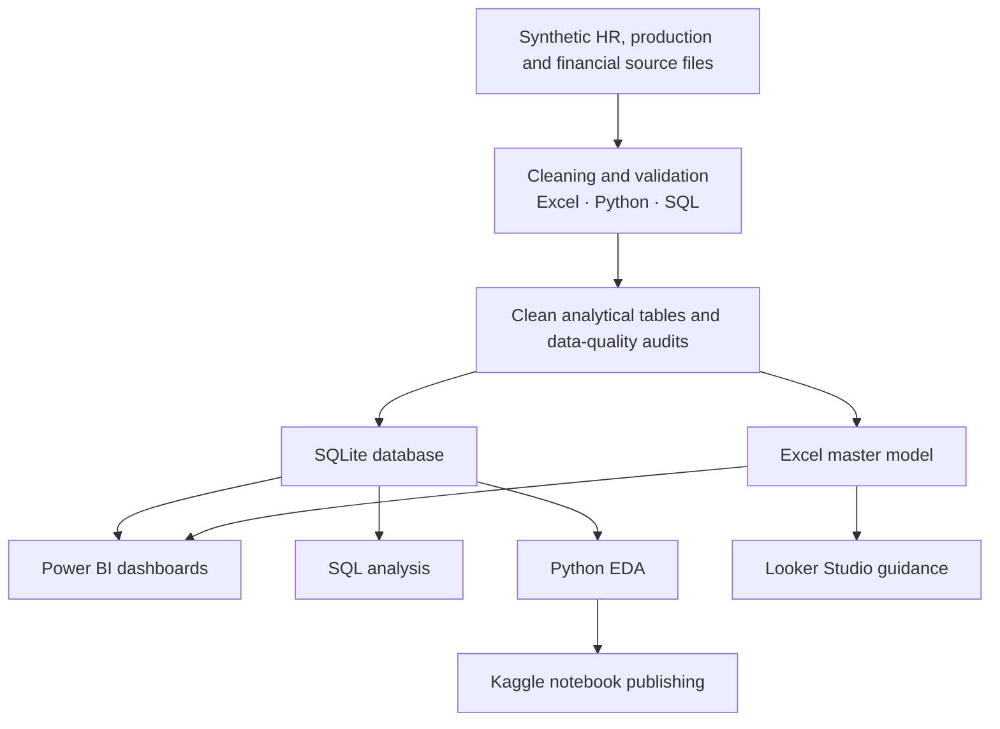

<p align="center">
  
</p>

<h1 align="center">Sabia Group HRBP Smartwatch Recovery 2026</h1>

<p align="center">
  <strong>A portfolio-grade, fully synthetic HRBP and business-recovery analytics project built for Bangladesh.</strong><br>
  From workforce diagnosis and production-quality recovery to executive-ready insights across Excel, Power BI, Python, SQL, SQLite and Kaggle.
</p>

<p align="center">
  <a href="https://www.kaggle.com/datasets/samusahr/sabia-hrbp-analytics"></a>
  
  
  
  
  
</p>

<p align="center">
  <a href="https://github.com/samusa099/sabia-hrbp/actions/workflows/validate-project.yml"></a>
  
  
  
  
  
  
</p>

<p align="center">
  <a href="https://github.com/samusa099/sabia-hrbp"><strong>GitHub Repository</strong></a>
  &nbsp;·&nbsp;
  <a href="https://www.kaggle.com/datasets/samusahr/sabia-hrbp-analytics"><strong>Kaggle Dataset</strong></a>
</p>

<p align="center">
  <a href="#-executive-overview">Executive Overview</a> ·
  <a href="#-portfolio-at-a-glance">Portfolio at a Glance</a> ·
  <a href="#-analytics-architecture">Architecture</a> ·
  <a href="#-repository-structure">Repository</a> ·
  <a href="#-platform-readiness">Platforms</a> ·
  <a href="#-quick-start">Quick Start</a> ·
  <a href="#-data-ethics">Data Ethics</a>
</p>

---

## ✨ Executive overview

<table>
<tr>
<td width="66%" valign="top">

**Sabia Group HRBP Smartwatch Recovery 2026** is a synthetic HR Business Partner and data analytics portfolio project created by **Musa**.

The project simulates a Bangladesh-based smartwatch manufacturing company facing workforce, quality, productivity and financial challenges. It demonstrates how an HRBP can connect people decisions with operational and financial outcomes through an integrated analytics workflow.

> **Business improvement through systems, not system building alone.**

</td>
<td width="34%" valign="top">

### Portfolio identity

| Attribute | Value |
|---|---|
| Author | Musa |
| Context | Bangladesh |
| Domain | HRBP + Manufacturing |
| Coverage | Q1–Q4 2026 |
| Data | Synthetic practice data |
| Status | Live and validated |

</td>
</tr>
</table>

<table>
<tr>
<td width="25%" align="center"><h3>100</h3><sub>Starting workforce</sub></td>
<td width="25%" align="center"><h3>114</h3><sub>Year-end active workforce</sub></td>
<td width="25%" align="center"><h3>97.1%</h3><sub>Final first-pass yield</sub></td>
<td width="25%" align="center"><h3>2.4%</h3><sub>Final defect rate</sub></td>
</tr>
</table>

### What makes this project distinctive

| Capability | What is included |
|---|---|
| **Business realism** | Bangladesh-focused names, facilities, departments, BDT values, manufacturing constraints and HR operating scenarios |
| **HRBP depth** | Workforce strategy, role diagnostics, critical-skill protection, hiring, learning, performance, ER, exits and governance |
| **Operational linkage** | HR metrics connected with first-pass yield, defects, rework, overtime, productivity and profitability |
| **Data engineering** | Raw practice files, clean tables, validation logic, SQLite objects and BI-ready views |
| **Portfolio usability** | Excel analytics, Python scripts, SQL queries, Power BI guidance, Kaggle assets, Wiki pages and documentation |
| **Ethical design** | No real employee, company or confidential data |

---

## 📊 Portfolio at a glance

<table>
<tr>
<td width="50%" valign="top">

### Business profile

| Area | Coverage |
|---|---|
| Business scenario | Smartwatch manufacturing recovery |
| Geography | Bangladesh |
| Time horizon | Q1–Q4 2026 |
| Controlled pilot | 25 employees on Line A |
| Publishing channels | GitHub and Kaggle |
| Validation status | GitHub Actions live |

</td>
<td width="50%" valign="top">

### Outcome profile

| Measure | Result |
|---|---:|
| Starting workforce | 100 employees |
| Year-end active workforce | 114 employees |
| Final first-pass yield | 97.1% |
| Final defect rate | 2.4% |
| Core analytics tools | Excel, Power BI, Python, SQL, SQLite |
| Data status | Fully synthetic practice data |

</td>
</tr>
</table>

### Analytics coverage

<table>
<tr>
<td width="33%" valign="top">

### 👥 Workforce

- Headcount and organization structure
- Workforce reset scenarios
- Critical-skill mapping
- Attendance and overtime
- Employee exits and knowledge transfer

</td>
<td width="33%" valign="top">

### 🎯 Talent and HR operations

- Recruitment funnel
- Time-to-fill and cost
- Training and certification
- Performance management
- HR services and technology adoption

</td>
<td width="33%" valign="top">

### 📈 Business recovery

- Production output
- First-pass yield
- Defect, rework and scrap
- Financial impact
- Q1–Q4 executive scorecards

</td>
</tr>
</table>

---

## 🧱 Analytics architecture



### Core data layers

| Layer | Purpose | Location |
|---|---|---|
| **Raw practice data** | Deliberately messy files for cleaning exercises | `05_Raw_Data/` |
| **Clean analytical data** | Analysis-ready HR, production and finance tables | `06_Clean_Data/` |
| **Python workflow** | Cleaning, validation and exploratory analysis | `07_Python/` |
| **BI model assets** | Relationships, DAX and dashboard guidance | `08_PowerBI/` |
| **Database layer** | SQLite tables, views, audits and query library | `13_Database_SQL/` |
| **Documentation** | Business case, methodology, ethics and Wiki pages | `11_Documentation/`, `wiki/` |

---

## 🗂️ Repository structure

<details open>
<summary><strong>View project structure</strong></summary>

<br>

| Area | Path | Purpose |
|---|---|---|
| Automation | `.github/workflows/` | CI validation workflow |
| Visual assets | `assets/` | Cover and project visuals |
| Master analytics | `00_Master/` | Excel master workbook |
| Q1 | `01_Q1_Plan_and_Reset/` | Planning and workforce reset |
| Q2 | `02_Q2_Controlled_Pilot/` | Pilot design and evaluation |
| Q3 | `03_Q3_Scale_and_Stabilize/` | Scale-up and stabilization |
| Q4 | `04_Q4_Full_Rollout/` | Enterprise rollout |
| Raw data | `05_Raw_Data/` | Messy practice files |
| Clean data | `06_Clean_Data/` | Analysis-ready datasets |
| Python | `07_Python/` | Cleaning, validation and EDA |
| Power BI | `08_PowerBI/` | Model, DAX and dashboard guidance |
| Looker Studio | `09_Looker_Studio/` | Connector and calculated-field guidance |
| Kaggle | `10_Kaggle/` | Dataset and notebook publishing assets |
| Documentation | `11_Documentation/` | Business case, methodology and ethics |
| Reference | `12_Reference/` | Project references |
| SQL database | `13_Database_SQL/` | SQLite database, views and query library |
| Validation | `scripts/` | Repository validation scripts |
| Wiki | `wiki/` | GitHub Wiki-compatible documentation |

<details>
<summary><strong>View root files</strong></summary>

```text
CITATION.cff
CONTRIBUTING.md
LICENSE
README.md
SECURITY.md
```

</details>

</details>

---

## 🧾 Core analytical tables

| No. | Table | Primary analytical purpose |
|---:|---|---|
| 01 | Employee Master | Workforce profile, employment status, cost and critical skills |
| 02 | Attendance Monthly | Absence, overtime, lateness and safety pressure |
| 03 | Recruitment Funnel | Hiring demand, conversion, cost and time-to-fill |
| 04 | Training Records | Learning hours, assessment, certification and cost |
| 05 | Production Monthly | Planned output, actual output, quality and productivity |
| 06 | Financial Impact Monthly | Revenue, costs, profit and cumulative recovery |
| 07 | Pilot Results | Pilot versus target, baseline and control comparison |
| 08 | Quarterly Scorecard | Executive Q1–Q4 KPI tracking |
| 09 | HR Pillar Scores | HR operating-model maturity and improvement |
| 10 | Data Dictionary | Field definitions and dataset metadata |

---

## 🔄 Data-cleaning and validation workflow

<table>
<tr>
<td width="58%" valign="top">

### Cleaning sequence

1. Standardize names, gender values and department labels.
2. Parse join, exit, training and production dates.
3. Convert invalid values into controlled missing values.
4. Clean BDT salary and cost fields.
5. Remove duplicate primary keys.
6. Filter records without a valid required `Join_Date`.
7. Validate uniqueness and required fields.
8. Write cleaned outputs and a data-quality report.

</td>
<td width="42%" valign="top">

### Run the workflow

```bash
python -m pip install -r 07_Python/requirements.txt
python 07_Python/clean_and_validate.py
```

### Expected output

```text
07_Python/generated_clean_output/
```

</td>
</tr>
</table>

<details>
<summary><strong>View generated outputs</strong></summary>

```text
07_Python/generated_clean_output/
├── employee_master_cleaned.csv
├── training_records_cleaned.csv
├── production_metrics_cleaned.csv
└── data_quality_report.csv
```

</details>

---

## 🗄️ Database and SQL layer

<table>
<tr>
<td width="55%" valign="top">

### Ready database

```text
13_Database_SQL/Sabia_Group_HRBP_Analytics.sqlite
```

The database contains:

- raw staging tables;
- clean analytical tables;
- SQL-based cleaning views;
- data-quality audit objects;
- HRBP analytics queries;
- Q1–Q4 business queries;
- `vw_bi_` reporting views.

</td>
<td width="45%" valign="top">

### Rebuild and query

```bash
python 13_Database_SQL/00_build_database.py
```

```sql
SELECT *
FROM vw_bi_quarterly_business_summary
ORDER BY Quarter;
```

</td>
</tr>
</table>

---

## 🧰 Platform readiness

<table>
<tr>
<td width="50%" valign="top">

### 🟨 Power BI

- Star-schema relationship guidance
- DAX measure library
- Executive page recommendations
- Folder and database connection options
- HR, production and financial reporting views

**Start here:** `08_PowerBI/`

</td>
<td width="50%" valign="top">

### 🟩 Excel

- Master analytics workbook
- Power Query-ready folders
- KPI scorecards
- Tables and charts
- Workforce and business-recovery practice

**Start here:** `00_Master/`

</td>
</tr>
<tr>
<td width="50%" valign="top">

### 🟦 Python and Jupyter

- Raw-data cleaning
- Validation reports
- Exploratory data analysis
- SQLite query examples
- Improved Kaggle notebook workflow

**Start here:** `07_Python/`

</td>
<td width="50%" valign="top">

### 🟪 SQL, SQLite and BI tools

- SQLite database
- Cleaning views
- Audit queries
- HRBP analytics library
- Power BI, DBeaver and DB Browser compatibility

**Start here:** `13_Database_SQL/`

</td>
</tr>
</table>

---

## 🚀 Quick start

<table>
<tr>
<td width="50%" valign="top">

### Clone and prepare

```bash
git clone https://github.com/samusa099/sabia-hrbp.git
cd sabia-hrbp
python -m pip install -r 07_Python/requirements.txt
```

### Run analytics

```bash
python 07_Python/clean_and_validate.py
python 07_Python/eda_hrbp_recovery.py
```

</td>
<td width="50%" valign="top">

### Query and rebuild

```bash
python 07_Python/query_sqlite_database.py
python 13_Database_SQL/00_build_database.py
```

### Open the data

- Excel: `00_Master/`
- Power BI guidance: `08_PowerBI/`
- SQLite: `13_Database_SQL/`
- Kaggle assets: `10_Kaggle/`

</td>
</tr>
</table>

---

## 🧭 Q1–Q4 transformation journey

| Quarter | Strategic focus | Key actions |
|---|---|---|
| **Q1** | Plan and reset | Feasibility analysis, workforce diagnosis, KPI design and documented role-reset scenarios |
| **Q2** | Controlled pilot | 25-person Line A pilot supported by HR, QA, Engineering and IT |
| **Q3** | Scale and stabilize | Critical-skill hiring, two-line scale-up and manager dashboards |
| **Q4** | Full rollout | Group-wide HR operating model, benefits review and governance handover |

<table>
<tr>
<td width="25%" align="center">✅<br><strong>97.1%</strong><br><sub>First-pass yield</sub></td>
<td width="25%" align="center">📉<br><strong>2.4%</strong><br><sub>Defect rate</sub></td>
<td width="25%" align="center">👥<br><strong>114</strong><br><sub>Active workforce</sub></td>
<td width="25%" align="center">📈<br><strong>Profitable model</strong><br><sub>Business direction</sub></td>
</tr>
</table>

---

## 🧠 Suggested analysis questions

1. How did workforce actions affect first-pass yield and defect rates?
2. Did training and certification support production recovery?
3. Which departments experienced the highest overtime and absence pressure?
4. Did the controlled pilot outperform the comparison group?
5. How did defect reduction relate to operating profit?
6. Which HR interventions created the strongest simulated business impact?
7. What data-quality issues must be resolved before management reporting?
8. Which critical skills should be protected during a workforce reset?

---

## 📚 Project Wiki

<details>
<summary><strong>Open Wiki navigation</strong></summary>

- [Home](wiki/Home.md)
- [Project Overview](wiki/Project-Overview.md)
- [Q1–Q4 Transformation Story](wiki/Transformation-Journey.md)
- [Data Architecture and Dictionary](wiki/Data-Architecture.md)
- [SQL and Database Lab](wiki/SQL-and-Database.md)
- [Power BI and BI Tools](wiki/Power-BI-and-BI-Tools.md)
- [Python Data Cleaning](wiki/Python-Data-Cleaning.md)
- [Kaggle Publishing](wiki/Kaggle-Publishing.md)
- [Ethics and Limitations](wiki/Ethics-and-Limitations.md)

</details>

---

## 🛡️ Data ethics

<table>
<tr>
<td width="66%" valign="top">

All people, entities, events, production results and financial values in this repository are **fictional and synthetically generated for practice, education and portfolio demonstration**.

This project:

- does not contain real employee or confidential company data;
- is not an audit of a real organization;
- does not establish causal relationships;
- must not be used to make real employment decisions;
- does not replace legal, labour-law, privacy or ethical review.

</td>
<td width="34%" valign="top">

### Responsible-use reminder

Protected characteristics such as gender, age, religion, disability, pregnancy, ethnicity or health status should never be used as unfair employment-decision criteria.

</td>
</tr>
</table>

---

## 👤 Author

<div align="center">

### Musa

**HRBP | HR & Data Analytics Practitioner | Bangladesh**

Workforce Strategy · People Analytics · Business Recovery · Excel · Power BI · Python · SQL

</div>

---

## 🔗 Additional documentation

<p align="center">
  <a href="13_Database_SQL/README_DATABASE_SQL.md">SQL & Database Guide</a> ·
  <a href="08_PowerBI/POWER_BI_AND_OTHER_BI_USAGE_GUIDE.md">Power BI Guide</a> ·
  <a href="11_Documentation/">Project Documentation</a> ·
  <a href="https://www.kaggle.com/datasets/samusahr/sabia-hrbp-analytics">Live Kaggle Dataset</a>
</p>

---

<div align="center">

### Practice data. Real analytical thinking. Business-focused HRBP portfolio.

⭐ Star the repository if you find the project useful.

</div>
