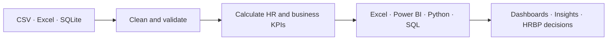

# Release Notes

## 🚀 v1.3.0 — 2026-07-29 — Documentation, automation and platform upgrade

<p align="center">
  <strong>A cleaner, better-documented and modernized HRBP analytics portfolio by Musa.</strong>
</p>

### 🌟 Release overview

Version **v1.3.0** consolidates the latest documentation, dependency, automation and repository-maintenance work for the **Sabia Group HRBP Smartwatch Recovery 2026** portfolio.

The release improves how learners, analysts, recruiters and reviewers understand, navigate and use the project across **Excel, Power BI, Python, SQL, SQLite, Jupyter, GitHub and Kaggle**.

> **Practice data. Real analytical thinking. Business-focused HRBP portfolio.**

### ✨ What is new

| Area | Improvement |
|---|---|
| 📘 Dataset guidance | Added a concise dataset-use overview to `README.md` |
| 🧭 Detailed documentation | Added `DATASET_USAGE_GUIDE.md` with formulas, workflows and use cases |
| 🗂️ Repository navigation | Added a compact Mermaid repository structure |
| 🤝 Contribution process | Added Mermaid-based contribution workflow and decision guidance |
| 🛡️ Community standards | Added an upgraded Code of Conduct with visual reporting flows |
| 🧹 Repository cleanup | Removed obsolete GitHub publishing scripts |
| ⚙️ CI modernization | Upgraded validation and security workflows |
| 📦 Dependencies | Consolidated the maintained Python analytics stack |
| 👤 Author identity | Standardized the public author display to **Musa** |

### 📚 Dataset usage coverage

The detailed usage guide explains **why, where and how** the dataset can be used for:

- 👥 headcount, growth, turnover, retention and workforce planning;
- 🎯 recruitment conversion, time-to-fill and cost-per-hire;
- 🎓 training completion, certification and skill improvement;
- 🏭 production output, productivity and downtime analysis;
- ✅ first-pass yield, defect, rework and scrap calculations;
- 💰 revenue, operating cost, profit and margin analysis;
- 💻 HRIS adoption and HR service efficiency;
- 📊 quarterly KPI, target-versus-actual and executive scorecards;
- 🧪 pilot-versus-control and intervention analysis.

### 🔄 Analytics workflow



### 🧹 Repository cleanup

The following obsolete publishing helpers were removed:

```text
PUBLISH_TO_GITHUB_WITH_GH.bat
PUBLISH_TO_GITHUB_WITH_GH.sh
PUSH_TO_EXISTING_GITHUB_REPO.bat
PUSH_TO_EXISTING_GITHUB_REPO.sh
```

The repository now follows the normal GitHub contribution, review and release workflow.

### ⚙️ Dependency and workflow modernization

#### Python analytics stack

```text
pandas>=3.0.3
matplotlib>=3.11.1
numpy>=2.5.1
jupyter>=1.1.1
```

#### GitHub Actions

```text
Python validation runtime: 3.12
actions/checkout: v7
actions/setup-python: v7
github/codeql-action: v4
```

Related Dependabot updates were reviewed, consolidated into `main`, and superseded pull requests were closed.

### 📊 Analytics coverage

| Domain | Included analysis |
|---|---|
| 👥 People and workforce | Headcount, workforce structure, attendance, overtime, critical skills, exits and retention |
| 🎯 HR operations | Recruitment, training, performance, HR services and technology adoption |
| 🏭 Operations | Production, productivity, FPY, defects, rework, scrap and downtime |
| 💰 Finance | Revenue, operating cost, workforce cost, profit and cumulative recovery |
| 🧭 Strategy | Q1–Q4 roadmap, pilot analysis, risk, scenarios, actions and executive scorecards |

### 🧰 Platform readiness

| Platform | Ready assets |
|---|---|
| 🟩 Excel | Workbooks, tables, scorecards and Power Query-ready data |
| 🟨 Power BI | Model guidance, DAX measures and dashboard recommendations |
| 🐍 Python | Cleaning, validation, EDA and visualization workflows |
| 🗄️ SQL / SQLite | Structured database, views and analytical queries |
| 📓 Jupyter | Portfolio-ready exploratory analysis notebook |
| 🔵 Kaggle | Published dataset, metadata and notebook assets |
| 🟦 GitHub | Documentation, CI validation, CodeQL and contribution standards |

### 🛡️ Responsible use

All people, entities, financial figures, production results and operational events in this project are **fictional and synthetically generated**.

- No real employee or confidential company data is included.
- The project is intended for education, analytics practice and portfolio demonstration.
- Results must not be used to make real employment decisions.
- Real implementation requires privacy, labour-law, ethical and organizational review.

### 👤 Author

**Musa**  
HRBP · HR & Data Analytics Practitioner · Bangladesh  
Workforce Strategy · People Analytics · Business Recovery · Excel · Power BI · Python · SQL

---

## v1.1.0 — 2026-07-24 — Power BI publication and security hardening

### 📊 Power BI project update

- Added the Power BI project file to the repository release scope.
- Confirmed the Power BI area remains part of the maintained analytics package under `08_PowerBI/`.
- Updated release documentation so users can identify the Power BI asset alongside Excel, Python, SQL, SQLite, and Kaggle resources.
- Preserved the supporting model, DAX, relationship, dashboard, and usage guidance already included in the repository.

### 🔐 Security and code protection

- Added `.github/CODEOWNERS` to protect security-sensitive configuration, analytics code, BI assets, and release documentation through explicit ownership.
- Added `.github/dependabot.yml` for weekly Python and GitHub Actions dependency updates.
- Added `.github/workflows/codeql.yml` for automated Python CodeQL analysis on pushes, pull requests, and a weekly schedule.
- Hardened `.github/workflows/validate-project.yml` with least-privilege permissions, dependency caching, concurrency control, and a job timeout.
- Expanded `SECURITY.md` with a private-reporting process, prohibited-content rules, remediation steps, and credential-history guidance.
- Reviewed open repository issues for vulnerability or security cases; no open vulnerability case was found at the time of this release.

### ✅ Vulnerability review status

The repository-level vulnerability review is closed as **completed** for this release. No confirmed open vulnerability issue was present in the accessible issue tracker. Automated checks remain active for future dependency, workflow, and Python-code findings.

### 🧹 Repository cleanup

The following obsolete publishing helper scripts were removed:

- `PUBLISH_TO_GITHUB_WITH_GH.bat`
- `PUBLISH_TO_GITHUB_WITH_GH.sh`
- `PUSH_TO_EXISTING_GITHUB_REPO.bat`
- `PUSH_TO_EXISTING_GITHUB_REPO.sh`

### 📚 Documentation improvements

- Added a concise dataset-use summary to `README.md`.
- Added `DATASET_USAGE_GUIDE.md` with use cases, calculations, and tool-specific workflows.
- Added Mermaid diagrams to repository structure, contribution guidance, and the code of conduct.
- Standardized the portfolio author name as **Musa**.

---

## 2026-07-24 — Repository cleanup and documentation upgrade

### Removed

The following obsolete publishing helper scripts were removed from the repository root:

- `PUBLISH_TO_GITHUB_WITH_GH.bat`
- `PUBLISH_TO_GITHUB_WITH_GH.sh`
- `PUSH_TO_EXISTING_GITHUB_REPO.bat`
- `PUSH_TO_EXISTING_GITHUB_REPO.sh`

These files were no longer required because the repository is already published and maintained through the normal GitHub workflow.

### Documentation improvements

- Added a concise dataset-use summary to `README.md`.
- Added the detailed `DATASET_USAGE_GUIDE.md` with practical use cases, calculation examples, tool-specific workflows, and responsible-use guidance.
- Added Mermaid diagrams to the repository structure, contribution workflow, and code of conduct.
- Standardized the portfolio author name as **Musa**.

### Project structure

- Preserved the existing analytics, dataset, workbook, notebook, SQL, Power BI, and documentation folders.
- No analytical data, business logic, project workbook, database, or notebook content was removed in this cleanup.

### Current publishing approach

Use standard Git commands for repository updates:

```bash
git add .
git commit -m "Describe the update"
git push origin main
```

For Kaggle publishing, use the maintained metadata and notebook assets under `10_Kaggle/` or the structured `KAGGLE_PACKAGE/` directory.
