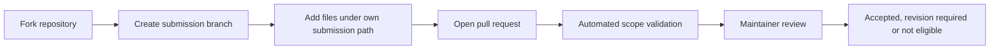

# 📥 Participant Submissions

Participant work must be submitted through a fork and pull request.

```text
submissions/
└── <github-username>/
    └── <submission-id>/
        ├── README.md
        ├── report.pdf
        ├── analysis.ipynb   # optional
        └── dashboard.png    # optional
```

## Workflow



Direct writes to the main repository are not part of the participant workflow. Read `case-study/SUBMISSION_REQUIREMENTS.md` before preparing files.