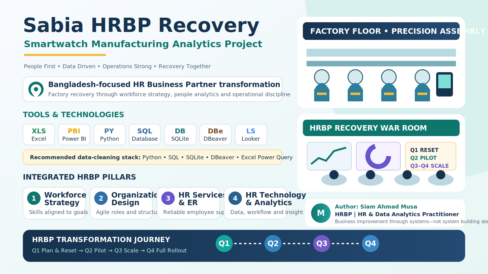

# Sabia HRBP Recovery

**Repository:** [samusa099/sabia-hrbp](https://github.com/samusa099/sabia-hrbp)

Sabia HRBP Recovery is a synthetic, Bangladesh-focused HR Business Partner and data analytics portfolio project. It demonstrates how an HRBP can connect workforce strategy, organization design, HR services, HR technology, production quality, and financial recovery.

## Project tools

Excel, Power BI, Python, SQL, SQLite, DB Browser for SQLite, DBeaver, Power Query, and optional Looker Studio.

## Core story

Sabia Group entered smartwatch production before validating an MVP or prototype. High defects, skill shortages, workload pressure, and operating losses created a business-sale risk. The strategic HRBP designed an approval-gated recovery programme:

- Q1 — Plan and reset
- Q2 — Controlled pilot
- Q3 — Scale and stabilize
- Q4 — Full rollout

## Wiki navigation

- [Project Overview](Project-Overview.md)
- [Transformation Journey](Transformation-Journey.md)
- [Data Architecture](Data-Architecture.md)
- [SQL and Database](SQL-and-Database.md)
- [Power BI and BI Tools](Power-BI-and-BI-Tools.md)
- [Python Data Cleaning](Python-Data-Cleaning.md)
- [Kaggle Publishing](Kaggle-Publishing.md)
- [Ethics and Limitations](Ethics-and-Limitations.md)
